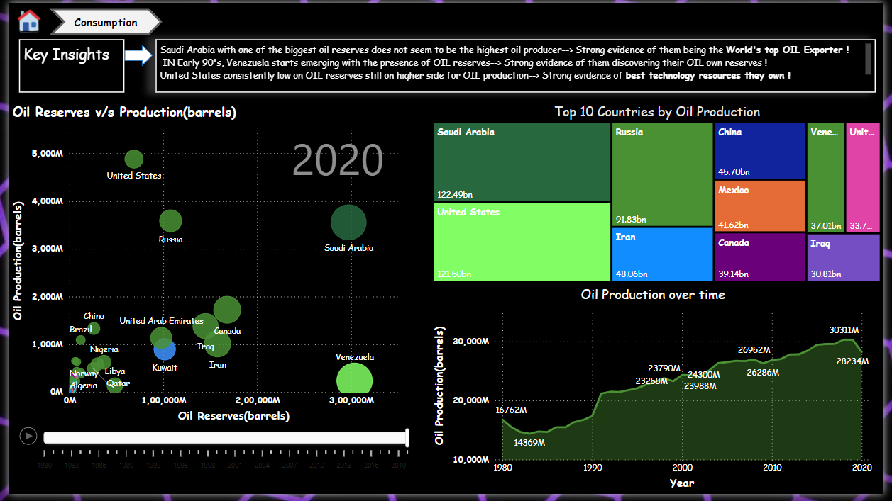
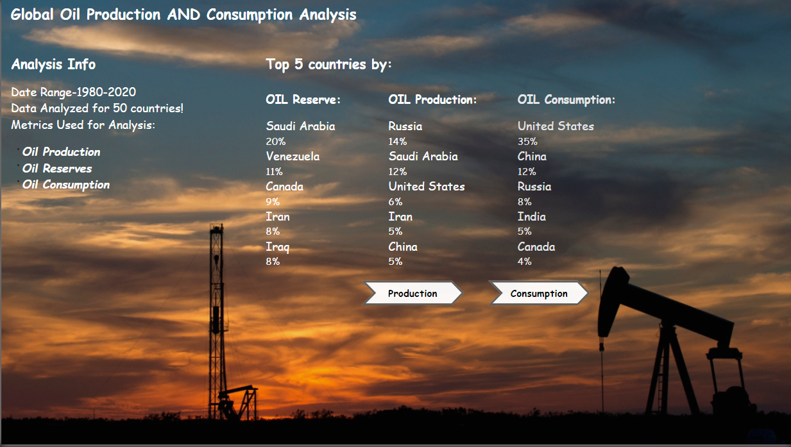
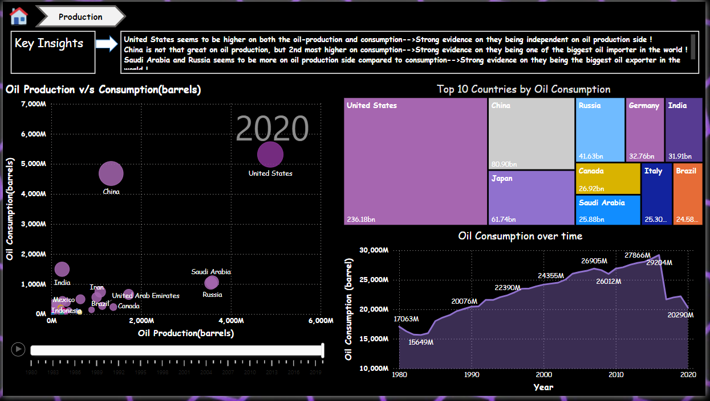

# 🌍 Global Oil Reserves, Production & Consumption Dashboard (1980–2020)

🚀 **Watch the Dashboard in Action**  
)

> 🎥 *Click the video above to watch the full dashboard walkthrough.*

---

## 📊 Dashboard Pages

### 🏠 Homepage

- Acts as the **entry point** for the dashboard.  
- Contains **two navigation buttons**:  
  - **Production**  
  - **Consumption**  
- Shows **Top 5 Countries** by(used TopN formula you can use Filter panel in your dashboard too):
  - Oil **Consumption**  
  - Oil **Reserves**  
  - Oil **Production**  

---

### ⚙️ Production Analysis

- Focuses on **Oil Reserves vs Oil Production**.  
- Includes a **Play Axis Animation (1980–2020)** to watch year-wise changes dynamically.  
- Lets users explore how reserves and production evolved **country by country** over decades.  

---

### ⚡ Consumption Analysis

- Focuses on **Oil Production vs Oil Consumption**.  
- Includes another **Play Axis Animation** showing how **countries’ consumption compares with their production over time**.  
- Helps identify top consumers, imbalances between production and consumption, and **global demand patterns**.  

---

## 📂 Dataset

The data comes from **Our World in Data** (public datasets):

- [Oil Reserves](https://ourworldindata.org/grapher/oil-proved-reserves?country=~OWID_WRL)  
- [Oil Production](https://ourworldindata.org/grapher/oil-production-by-region)  
- [Oil Consumption](https://ourworldindata.org/grapher/oil-consumption-by-region-terawatt-hours-twh)  

These datasets were **transformed and modeled in Power BI** for storytelling and interactivity.

---

## 💡 Key Insights
- Global oil production and consumption have **increased significantly since 1980**.  
- A few countries dominate reserves and production capacity.  
- Consumption highlights **regional dependencies** and **shifts in global demand**.  
- **Play Axis visuals** make it easier to see how production and consumption evolve over time.  

---

## 📌 Tech Stack
- **Power BI Desktop**  
- **Data Modeling & DAX**  
- **Interactive Storytelling**  

---

---

## 🤝 Connect with Me  

If you have any questions, feedback, or suggestions about this project, feel free to reach out!  
💬 Let’s connect on
💼 [LinkedIn](https://www.linkedin.com/in/pradumnchauhan)!

📧 [Email](pradumnchauhan2812@gmail.com)!

